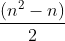

# Postprocessing of ipod data

For the purposes of this distribution of tools, postprocessing refers to
calling peaks and EPODS in the protein occupancy data after a final set
of IPOD enrichment scores has been calculated.

## Running the peak and epod calling driver script

From within our provided singularity container ([see here for instructions for
using our container][singularity]), running the following will perform
peak and epod calling:

```bash
python /src_for_distrib/drivers/do_peak_and_epod_calls.py /ipod_data/main.conf
``` 

## Peak calling

Peak calling is performed by using either robust z-scores or log10p-values.
We first calculate a rolling mean score at each position. The width of the
window is defined by `windowsize_bp` ([link][window-bp]) in the peaks section of the
top-level configuration file.

We then go through the rolling mean scores to define any position whose score
is above a given threshold as a peak. We use several score thresholds, defined
by the `rz_thresholds` ([link][rz-thresh]) and `log10p_thresholds`
([link][log10p-thresh]) options in the peaks section of the top-level
configuration file.

Resulting narrowpeaks files will be written for each score type (robust z-score and log10p value), and for each threshold.

## EPOD calling

Options for EPOD calling can be set [here][epod-opts] in the main configuration
file. Of note are `loose_epod_length` and `strict_epod_length`. These options
set the minimum length for which the pipeline will call a region a "loose" epod or
a "strict" epod, respectively.

We find that having both the loose epod calls and strict epod calls is very helpful
when interpreting the calls. For instance, if a strict epod is absent in one
condition but present in another, check the loose epod calls for that region to
see whether a loose epod is present in both. If a loose epod is present in both
conditions, the absence of a strict epod in one condition should receive less
weight in your final interpretation of results.

## Irreproducible discovery rate

For both peak and EPOD calling, we calculate the irreproducible discovery rate
(IDR, doi:10.1214/11-AOAS466;
[click here for link](https://projecteuclid.org/journals/annals-of-applied-statistics/volume-5/issue-3/Measuring-reproducibility-of-high-throughput-experiments/10.1214/11-AOAS466.full)).
IDR calculation works on one pair of replicates at a time.
Therefore, we have chosen to perform pairwise IDR calculations for each pair of
replicates, resulting in 
comparisons, where n is the number of replicates performed.

After calculating each pairwise IDR, we determine, for each position in the genome,
the fraction of comparisons that passed the threshold IDR <= x, where x is the
value set by the `threshold` option in the `idr` section of the main configuration
file.
Any region containing contiguous positions for which at least half of the pairwise
IDR calculations pass this threshold are reported in a final narrowpeaks output file.

[window-bp]: main_config.md#windowsize-bp
[rz-thresh]: main_config.md#rz-thresholds
[log10p-thresh]: main_config.md#log10p-thresholds
[singularity]: ../README.md#singularity-use
[epod-opts]: main_config.md#epods
